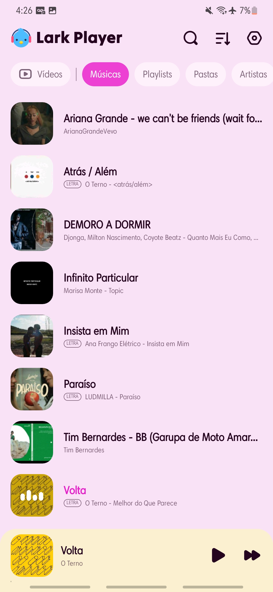
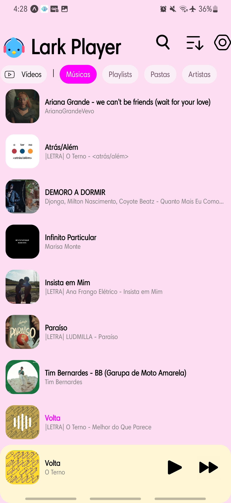
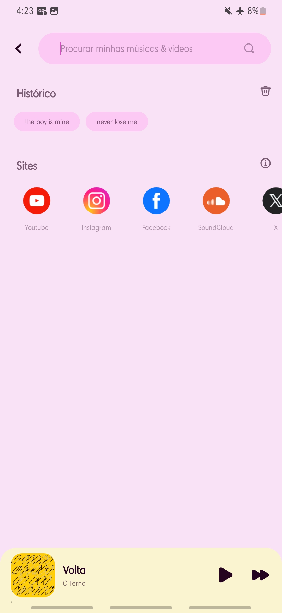
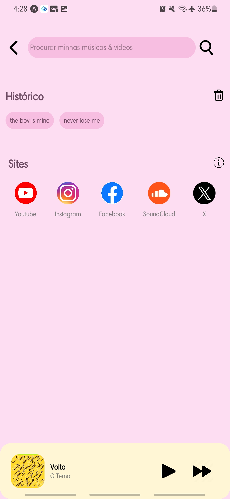

# 📱 Trabalho Individual de Desenvolvimento Mobile

Este projeto é um **clone de duas telas** do aplicativo **Lark Player**, desenvolvido com **React Native** e **TypeScript**. O foco foi na construção de interfaces utilizando os componentes `Image`, `Text`, `TextInput`, `View` e estilos com `StyleSheet` externo.

## Tecnologias Utilizadas
- React Native
- TypeScript
- Componentes: Image, Text, TextInput, View
- Estilização com StyleSheet externo

## 🖼️ Telas Clonadas

### Primeira Tela Original/ Primeira Tela Clonada
    

### Segunda Tela Original/ Segunda Tela Clonada
    

